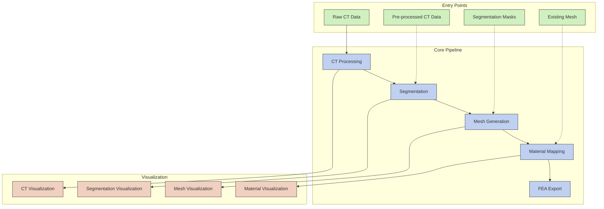

# Detailed Implementation Plan for CT2FEA Streamlining

This document outlines the comprehensive implementation plan to streamline the CT2FEA repository, making it more accessible to non-software engineers while preserving essential functionality.

## 1. New Architecture Overview



## 2. Detailed Implementation Steps

### 2.1. Dependency Cleanup

1. **Update requirements.txt**
   - Remove: `pyvistaqt`, `pyopencl`, `numba`, `black`, `mypy`
   - Keep: `numpy`, `scipy`, `scikit-image`, `pyvista`, `meshio`, `tifffile`, `matplotlib`

2. **Remove GPU Acceleration Code**
   - Delete `acceleration/` directory
   - Remove GPU-related parameters from configuration

3. **Simplify Parallel Processing**
   - Replace complex parallel processing with basic multiprocessing
   - Simplify the `utils/parallel.py` module

### 2.2. Code Restructuring

1. **Refactor Pipeline Class**
   - Convert `Pipeline` class in `main.py` to standalone functions
   - Create clear entry points for each pipeline stage
   - Implement simple function-based workflow

2. **Simplify Configuration**
   - Reduce parameters in `config.py` to essential options
   - Provide sensible defaults for non-critical parameters
   - Create simplified configuration validation

3. **Streamline CLI Interface**
   - Update `cli.py` to support multiple entry points
   - Add clear command-line options for each stage
   - Improve help documentation and examples

### 2.3. Module Reorganization

1. **Processing Module**
   - Combine `ct_processing.py` and `segmentation.py` into a unified module
   - Simplify processing functions and remove complex algorithms
   - Create clear interfaces between processing steps

2. **Meshing Module**
   - Combine `voxel_mesher.py` and `fea_writer.py` into a single `mesh.py` module
   - Simplify mesh generation and export functions
   - Create clear interfaces for loading external meshes

3. **Materials Module**
   - Simplify material property mapping
   - Remove complex material models (keep only linear elastic)
   - Create clear interfaces for material assignment

### 2.4. Visualization Implementation

1. **Create Visualization Module**
   - Implement basic 2D slice visualization for CT data
   - Create segmentation overlay visualization
   - Implement simple 3D mesh rendering
   - Add material property visualization

2. **Integration with Pipeline**
   - Add visualization flags to configuration
   - Call visualization functions at the end of each pipeline stage
   - Generate output images and reports

### 2.5. Error Handling Simplification

1. **Simplify Error Handling**
   - Replace complex error recovery with simple error messages
   - Add descriptive error messages for common issues
   - Implement basic validation for each pipeline stage

### 2.6. Documentation

1. **Update README**
   - Document simplified workflow
   - Provide examples for each entry point
   - Include sample commands for common use cases

2. **Create Examples**
   - Add example scripts for each pipeline stage
   - Include sample data and expected outputs
   - Document visualization outputs

## 3. New File Structure

```
ct2fea/
├── __init__.py
├── __main__.py
├── config.py           # Simplified configuration
├── cli.py              # Streamlined CLI with entry points
├── main.py             # Simplified pipeline functions
├── io/
│   ├── __init__.py
│   └── file_io.py      # Simplified I/O operations
├── processing/
│   ├── __init__.py
│   └── ct_processing.py # Combined processing & segmentation
├── meshing/
│   ├── __init__.py
│   └── mesh.py         # Combined mesh generation & export
├── materials/
│   ├── __init__.py
│   └── properties.py   # Simplified material mapping
├── visualization/
│   ├── __init__.py
│   ├── ct_vis.py       # CT data visualization
│   ├── segment_vis.py  # Segmentation visualization
│   └── mesh_vis.py     # Mesh and material visualization
└── examples/
    ├── ct_processing_example.py
    ├── segmentation_example.py
    ├── mesh_generation_example.py
    └── material_mapping_example.py
```

## 4. Implementation Timeline

1. **Phase 1: Core Restructuring**
   - Dependency cleanup
   - Pipeline refactoring
   - Configuration simplification

2. **Phase 2: Module Reorganization**
   - Processing module reorganization
   - Meshing module reorganization
   - Materials module simplification

3. **Phase 3: Visualization Implementation**
   - Basic visualization functions
   - Integration with pipeline
   - Output generation

4. **Phase 4: Documentation and Examples**
   - README updates
   - Example scripts
   - Usage documentation

## 5. Expected Benefits

1. **Accessibility**: Non-software engineers can use the tool without understanding complex code
2. **Flexibility**: Users can start at any stage of the pipeline
3. **Maintainability**: Simpler code is easier to maintain and extend
4. **Usability**: Basic visualization helps users verify results
5. **Clarity**: Clear entry points and documentation improve user experience